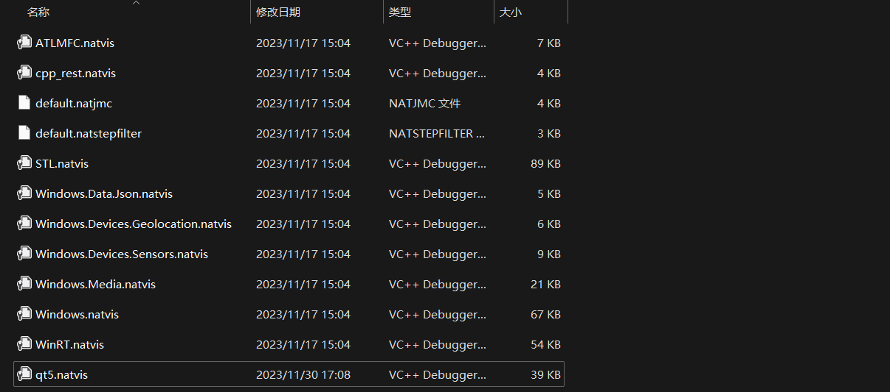
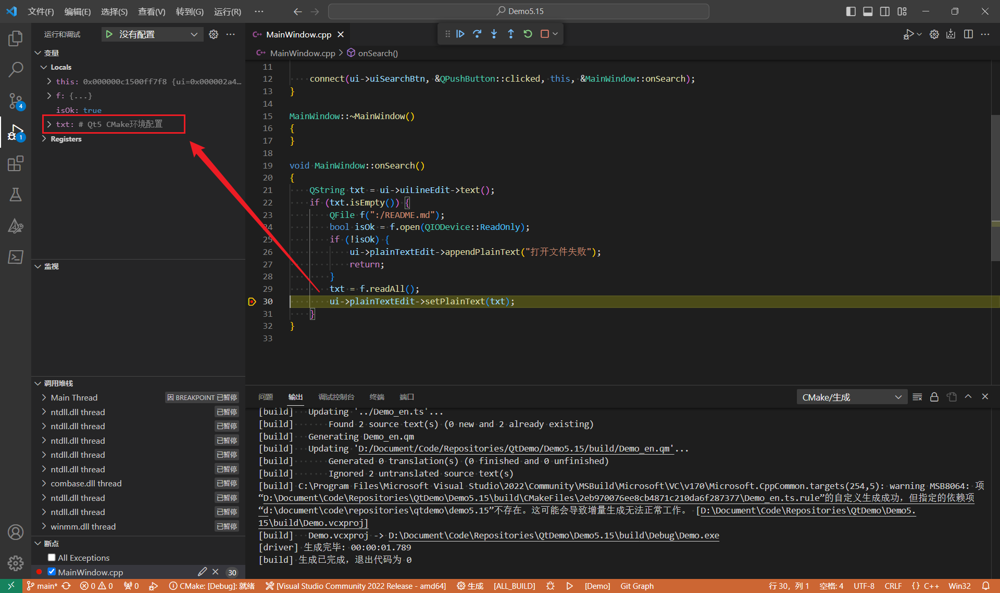

# Qt5 CMake环境配置

## 设置Qt路径

有两种方法

- `Qt5_DIR`，使用这个变量，必须把路径设置到`Qt5Config.cmake`所在文件夹，也就是安装目录下的`lib/cmake/Qt5`
- `CMAKE_PREFIX_PATH`，只需要设置到安装目录就可以了，这个目录就是`bin`、`lib`等文件夹所在目录

```cmake
# set(CMAKE_PREFIX_PATH "E:\\ProgramFiles\\Qt\\5.15.2\\msvc2019_64;${CMAKE_PREFIX_PATH}")
# set(Qt5_DIR "D:\\ProgramFiles\\Qt\\5.15.2\\5.15\\msvc_2015_64\\lib\\cmake\\Qt5")
set(CMAKE_PREFIX_PATH "D:\\ProgramFiles\\Qt\\5.15.2\\5.15\\msvc_2015_64;${CMAKE_PREFIX_PATH}")
```

## 启用代码生成

用于处理信号槽代码生成、资源文件生成、UI文件生成

```cmake
set(CMAKE_AUTOMOC ON)
set(CMAKE_AUTORCC ON)
set(CMAKE_AUTOUIC ON)
```

## 查找需要的库

`LinguistTools`是为了处理ts文件用的，无需链接

```cmake
find_package(Qt5 COMPONENTS Core Widgets LinguistTools REQUIRED)
``

链接的时候可以直接使用`Qt::`作为前缀，不需要`Qt5::`

```cmake
target_link_libraries(${PROJECT_NAME} PUBLIC Qt::Core Qt::Widgets)
```

## 添加翻译文件

使用`qt5_create_translation`

从当前目录中的源文件中递归查找Qt翻译，并使用lupdate生成或更新Demo_en.ts和Demo_fr.ts文件。将所述文件编译为构建目录中的Demo_fr.qm和Demo_fr.qm文件：

```cmake
set(TS_FILES Demo_en.ts Demo_fr.ts)
qt5_create_translation(QM_FILES ${CMAKE_SOURCE_DIR} ${TS_FILES})
```

`QM_FILES`是输出变量

## 添加编译文件

对于qrc文件和ui文件，直接`add_executable`就可以了

```cmake
add_executable(
    ${PROJECT_NAME}
    main.cpp
    MainWindow.h
    MainWindow.cpp
    MainWindow.ui
    resources.qrc
    ${QM_FILES}
)
```

## 源码

```cmake
cmake_minimum_required(VERSION 3.18)
project("Demo" VERSION 1.0.0 LANGUAGES CXX)

# set(CMAKE_PREFIX_PATH "E:\\ProgramFiles\\Qt\\5.15.2\\msvc2019_64;${CMAKE_PREFIX_PATH}")
# set(Qt5_DIR "D:\\ProgramFiles\\Qt\\5.15.2\\5.15\\msvc_2015_64\\lib\\cmake\\Qt5")
set(CMAKE_PREFIX_PATH "D:\\ProgramFiles\\Qt\\5.15.2\\5.15\\msvc_2015_64;${CMAKE_PREFIX_PATH}")

set(CMAKE_CXX_STANDARD 11)
set(CMAKE_CXX_STANDARD_REQUIRED ON)

set(CMAKE_AUTOMOC ON)
set(CMAKE_AUTORCC ON)
set(CMAKE_AUTOUIC ON)

if(CMAKE_VERSION VERSION_LESS "3.7.0")
    set(CMAKE_INCLUDE_CURRENT_DIR ON)
endif()

set(CMAKE_INCLUDE)

find_package(Qt5 COMPONENTS Core Widgets LinguistTools REQUIRED)
message(STATUS "${Qt5Widgets_LIBRARIES}")
message(STATUS "${Qt5Core_LIBRARIES}")

set(TS_FILES Demo_en.ts Demo_fr.ts)

qt5_create_translation(QM_FILES ${CMAKE_SOURCE_DIR} ${TS_FILES})
message(STATUS "QM File List: ${QM_FILES}")

add_executable(
    ${PROJECT_NAME}
    main.cpp
    MainWindow.h
    MainWindow.cpp
    MainWindow.ui
    resources.qrc
    ${QM_FILES}
)

target_include_directories(${PROJECT_NAME} PUBLIC ${Qt5Widgets_INCLUDE_DIRS})
target_link_libraries(${PROJECT_NAME} PUBLIC Qt::Core Qt::Widgets)

```


## 参考

[Qt5文档](https://doc.qt.io/qt-5/cmake-manual.html)


## 配置可视化调试


### 使用GlobalVisualizersDirectory


Windows下

```txt
C:\Users\YourName\.vscode\extensions\ms-vscode.cpptools-1.18.5-win32-x64\debugAdapters\vsdbg\bin\Visualizers\
```

Linux下

```txt
~\.vscode\extensions\ms-vscode.cpptools-1.18.5-win32-x64\debugAdapters\vsdbg\bin\Visualizers\
```

打开目录可以发现，里面已经存在了一些natvis文件


借用EveryThing等工具，搜索`qt5.natvis`、`qt6.natvis`、`STL.natvis`等文件，复制到这个文件夹内

### visualizerFile

配置`visualizerFile`参数，natvis文件只能指定一个

```json
{
    "cmake.debugConfig": {
        "visualizerFile": "${workspaceFolder}/qt5.natvis"
    }
}
```

这个参数本来属于launch.json，因为我使用的是cmake插件，所以配置的是cmake

lanuch.json应该参考下面的代码，其实是一样的，而且还可以多配置一个`showDisplayString`

```json
{
  "name": "C++ Launch (Windows)",
  "type": "cppvsdbg",
  "request": "launch",
  "program": "C:\\app1\\Debug\\app1.exe",
  "symbolSearchPath": "C:\\Symbols;C:\\SymbolDir2",
  "externalConsole": true,
  "logging": {
    "moduleLoad": false,
    "trace": true
  },
  "visualizerFile": "${workspaceFolder}/my.natvis",
  "showDisplayString": true
}

```

### 效果展示

可以看到`QString`这样的类型已经正确显示




