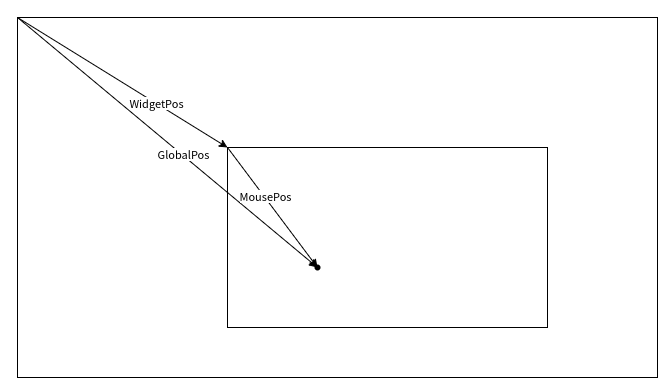

# Qt无边框和阴影

## 无边框

借助`setWindowFlags()`函数

该函数接收一个`Qt::WindowType`类型的枚举值

其所有取值可以在[Qt文档-WindowType](https://doc.qt.io/qt-6/qt.html#WindowType-enum)查看

`FramelessWindowHint`就是无边框参数

## 拖拽



如图，外部矩形代表桌面，内部矩形代表窗口，窗口内的点代表鼠标点击位置

那么就有三个向量：`GlobalPos`（鼠标在桌面的全局位置）、`WidgetPos`（窗口左上角在桌面的位置）、`MousePos`（鼠标相对桌面的位置）

三个向量之间的关系为：`MousePos=GlobalPos-WidgetPos`和`WidgetPos=GlobalPos-MousePos`

在鼠标按下的瞬间，可以从`MouseEvent`的`globalPosition`接口获取全局位置，从`QWidget`下`geometry`的`topLeft`接口获取窗口相对桌面的位置，根据第一个式子就可以求出鼠标相对于窗口的位置

在窗口拖动过程中，鼠标相对于窗口的位置始终不变，而全局位置一直在变换，可以根据第二个式子计算窗口相对桌面的位置

鼠标按下事件
```c++
void UiMain::mousePressEvent(QMouseEvent *event)
{
    QWidget::mousePressEvent(event);
    // 获取鼠标相对于桌面左上角的位置-全局位置
    QPointF globalPos = event->globalPosition();
    // 获取当前窗口左上角在桌面中的位置-窗口位置
    QPointF widgetPos = this->geometry().topLeft();
    // 计算鼠标在窗口的相对位置
    // 鼠标相对窗口位置在移动过程中不变
    _mouse_pos = globalPos - widgetPos;
}

```

鼠标移动事件：
```c++
void UiMain::mouseMoveEvent(QMouseEvent *event)
{
    QWidget::mouseMoveEvent(event);
    // 获取鼠标相对于桌面左上角的位置-全局位置
    QPointF globalPos = event->globalPosition();
    // 计算窗口在桌面的位置
    QPointF widgetPos = globalPos - _mouse_pos;
    // 设置窗口位置
    this->move(widgetPos.toPoint());
}

```
